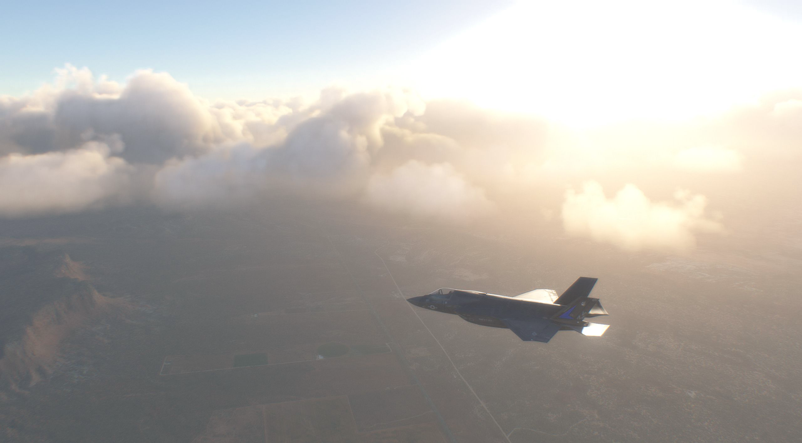

# MSFS 2020 Postprocessing

A small piece of code which intends to make Microsoft Flightsim 2020 (MSFS2020) screenshots a little bit more realistic by applying the following image "filters" or transformations:

- Application of distributed gaussian noise
- Chromatic abberation (wavelength-dependent defraction in the camera's lens) and lens blurring
- Bloom
- Purple fringing (when UV light hits the CMOS sensor)
- Weak embossing as a simulation of parasitic voltages in the CMOS sensor
- Inverse dynamic range transform
- Theermal CCD sensor noise
- ISO noise
- Two-pass JPEG Compression

### Examples:

| Input                   | Output                   |
|:-----------------------:|:------------------------:|
|||
|||
|||